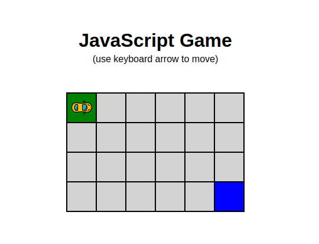

# Mini jeu JavaScript

Ce mini jeu est réalisé uniquement en HTML, CSS et JavaScript Vanilla.

Le but du jeu est de déplacer la voiture d'un point A à un point B. 

#### /!\ Attention, tu ne dois pas sortir du cadre !

N'hésitez à partager le projet sur Linked-In si vous l'avez aimé ! 

Pour accéder à mon profil Linked-In, [cliquez ici](https://www.linkedin.com/in/guillaume-pirard/ "Mon profil Linked-In") !

